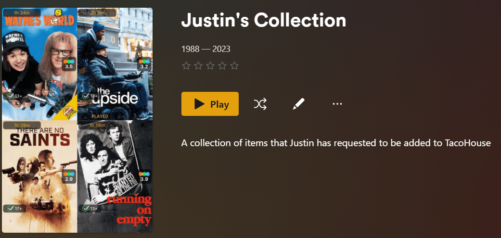

 

The rule system behind Maintainerr is quite complex, and therefore powerful. When you get the hang of it, you will be cleaning up that mess you call a library in no time.
 

# Tutorial

Let's take this movie as an example. This isn't a real movie, but for the purposes of this tutorial we are going to pretend. This movie has the following attributes across Plex, OverSeerr, and Radar:

**Plex** -

| Added | Last Viewed | Times Viewed | Audience Rating |
| -------|-------------|--------------|---------------- |
| 3Nov2023 | 10Jan2024 | 4 | 7.3 |

**OverSeerr** - 

| Requested by | Requested Date | Times Requested by Anyone|
| ------------| --------------- | ------------- |
| user_girl123 | 2Nov2023 | 4 |

**Radarr** - 

| Release Date | Is Monitored | Runtime |
| ------------ | ------------ | ------- |
| 31Oct2023 | True | 114 minutes | 

 

> :bulb: This information can be looked at for an actual item in your Plex library. You can do it through the Plex UI or you can parse through the XML of an item.
<a href="https://support.plex.tv/articles/201998867-investigate-media-information-and-formats/#:~:text=Open%20the%20Media,the%20XML%20information"> 🌐 -> <u>Link to see how to get your Plex Media Info and XML data</u> </a>

We want to make a rule that would add this movie to it's collection. This won't be the only movie in the collection. However, all of the other movies that will be added into this collection matched the rule for the same reason/s.

## Setup
We will start from the top of a new rule.

>

- 1: This is the name of the Rule, and will eventually be the name of the Collection that gets created.
- 2: Self explanatory but you can put whatever you want here. It will be shown in Plex when you open the collection.
     

- 3: Drop-down list of your Plex Libraries. Which library is this rule going to be run against?
- 4: This will not be shown if you select a Movies library for #3. If you selected a TVShow library, your options are show/season/episode. What type of TVShow are we going to run the rule against? An entire show, just seasons, or just episodes? Different options are avaialable for each.
- 5: Sonarr/Radarr action is what is going to happen after the `action after days` set in #6. Options are dependent on the library and media type from above.
- 6: Think of this as a "delay" setting. How many days after this rule is ran, items have been matched to your filter parameters and added to the collection, will we execute the action set in #5?

- 1: How many days are we going to keep logs of this collections actions?
- 2: Is this Rule active? Will it be one of the rules ran either by a manual run, or through the scheduled runs?
- 3: Is this collection going to be shown on the Plex Home screen, or are you only going to be able to see it through the Plex Library screen?
- 4: When the action set in #5 from our previous screenshot is taken, will Maintainerr also send a hit back to Sonarr/Radarr that excludes this item from being automatically added by any lists?
- 5: When the action set in #5 from our previous screenshot is taken, will we tell Overseerr that this item is no longer avaiable and can be requested again?
- 6: You can toggle the rule system off and on. This is useful if you have collections in Plex that you want to see in Maintainerr, but don't want any actions taken on that rule.
- 7: You can create a collection in Plex, and use that collection in Maintainerr. If you are doing that, tick the Custom Collection box to on.
 
   > 