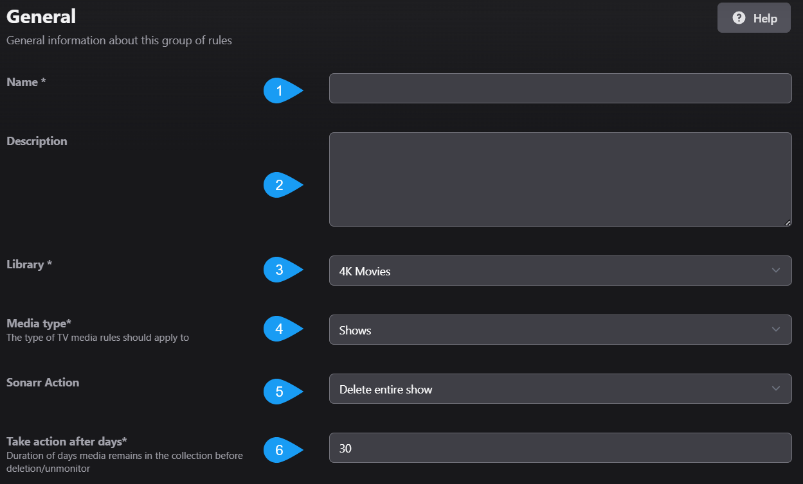
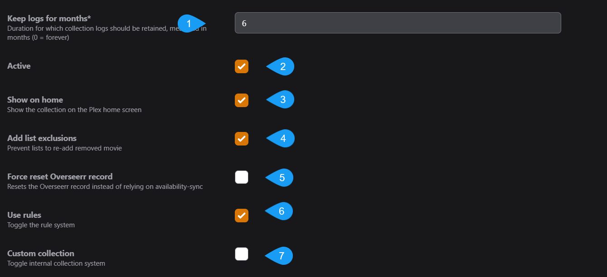

 

The rule system behind Maintainerr is quite complex, and therefore powerful. When you get the hang of it, you will be cleaning up that mess you call a library in no time.
 

# Tutorial

</img>

Let's take this movie as an example. This isn't a real movie, but for the purposes of this tutorial we are going to pretend. This movie has the following attributes across Plex, OverSeerr, and Radar:

**Plex** -

| Added | Last Viewed | Times Viewed | Audience Rating |
| -------|-------------|--------------|---------------- |
| 3Nov2023 | 10Jan2024 | 4 | 7.3 |

**OverSeerr** - 

| Requested by | Requested Date | Times Requested by Anyone|
| ------------| --------------- | ------------- |
| user_girl123 | 2Nov2023 | 4 |

**Radarr** - 

| Release Date | Is Monitored | Runtime |
| ------------ | ------------ | ------- |
| 31Oct2023 | True | 114 minutes | 

 

> :bulb: This information can be looked at for an actual item in your Plex library. You can do it through the Plex UI or you can parse through the XML of an item.
<a href="https://support.plex.tv/articles/201998867-investigate-media-information-and-formats/#:~:text=Open%20the%20Media,the%20XML%20information"> 🌐 -> <u>Link to see how to get your Plex Media Info and XML data</u> </a>

We want to make a rule that would add this movie to it's collection. This won't be the only movie in the collection. However, all of the other movies that will be added into this collection matched the rule for the same reason/s.

## Rule Setup
We will start from the top of a new rule.

</img>

- 1: This is the name of the Rule, and will eventually be the name of the Collection that gets created.
- 2: Self explanatory but you can put whatever you want here. It will be shown in Plex when you open the collection.
     

- 3: Drop-down list of your Plex Libraries. Which library is this rule going to be run against?
- 4: This will not be shown if you select a Movies library in #3. If you selected a TVShow library, your options will be shows/seasons/episodes. What type of TVShow media are we going to run the rule against? An entire show, just seasons, or just episodes? Different options will be made avaialable to you or taken away, depending on what you select here.
- 5: Sonarr/Radarr action is what is going to happen after the `action after days` set in #6. Options are dependent on the library and media type from above. `Delete` will remove the files and the item from Sonarr/Radarr. `Unmonitor and delete` will unmonitor (not remove) the item from Sonarr/Radarr but delete the files. `Unmonitor and keep` will unmonitor the item from Sonarr/Radarr and <u>**keep**</u> the files.
- 6: Think of this as a "delay" setting. How many days after this rule is ran, items have been matched to this rules filter parameters and added to the collection, will we execute the action set in #5?

</img>

- 7: How many days are we going to keep logs of this collections actions?
- 8: Is this Rule active? Will it be one of the rules ran either by a manual run, or through periodic runs?
- 9: Is this collection going to be shown on the Plex Home screen, or are you only going to be able to see it through the Plex Library screen?
- 10: When the action set in #5 from our previous screenshot is taken, will Maintainerr also send a hit back to Sonarr/Radarr that excludes this item from being automatically added by any import lists?
- 11: When the action set in #5 from our previous screenshot is taken, will we tell Overseerr that this item is no longer avaiable and can be requested again?
- 12: You can toggle the rule system off and on. This is useful if you have collections in Plex that you want to see in Maintainerr, but don't want any actions taken on the collection.
- 13: You can create a collection in Plex, and then use that collection in Maintainerr. If you are doing that, tick this Custom Collection box to on. This can be useful if there is a collection made by say PMM or by you, and you want to execute some rules against it.
 
   > </img>

## Rule Configuration
Now we are getting into the nitty gritty. After the settings above have been configured to your liking, you start to craft the rule logic. There is an button labeled Community, which are rule setups that have been shared by others. Clicking on this button will list the "uploaded" rules and you can use one of these rules if you wish. Clicking on a rule and then clicking on the info button down below, will give you uploaders description of that rule and possibly how it works.
> :memo: Community rules are just that, from the community. They may not work like they say they do. They may not be formatted properly. It can be a nice place to start but I personally wouldn't rely on them as everyones situation is different. 

Below the **Community** button there are two other buttons. Import and Export. You can import a rule from a txt file in YAML format (this is an advanced method but it is an option). 
 > :memo: If you want to go down this path, I would choose one of the Community rules, doesn't really matter which one, and then use the export button. You will get a generated YAML format of the rule. If you are familiar with YAML this will be a good place to start. Take a look at this page for the proper syntax of each parameter -> [Rules Glossary](https://docs.maintainerr.info/en/Glossary). 
 
 If you are looking at a rule that you have already created, you can export the rule in YAML format in order to share it or textually edit it. 
### Rules and Sections
Understanding rules and sections can be crucial to getting your rule setup properly and acheiving your desired outcome.

When you first start, you will be in the first *section*. Section #1 - Rule #1. A section is a grouped set of rules with one output over the whole section, depending on what was matched in the rules *within* that section.

So let's try an **AND** example...
- Our rule 1 setup gains us output X and output Y.
- Our rule 2 setup gains us output X.
- Our rule 2 is setup with an AND operator to rule 1.
- The output of this section would be X only.
  - Since X was matched by rule 1 AND rule 2 but Y was only matched by rule 1, it will not be included in the sections output because we said we want the output of the *section* to be everthing that matched rule 1 AND rule 2.

Now an **OR** example...
- Our rule 1 setup gains us output X and output Y.
- Our rule 2 setup gains us output X and output Z.
- Our rule 2 is setup with an OR operator to rule 1.
- The output of this section would be X, Y, and Z.
  - Since X and Y were matched by rule 1 and X and Z were matched by rule 2, they are all included because we said we want the output of the *section* to be everything that matched rule 1 OR rule 2.

This is probably the simplest form of a rule setup that you can get. Well, unless of course you are only using one rule then it is self explanatory. Anything matched by that one rule becomes the output.

Now let's try a mixed **AND** / **OR** example...
- Rule 1 setup gains us output X and output Y.
- Rule 2 setup gains us output X.
- Rule 2 is setup with an AND operator to rule 1.
- The output is X, as before.
- Rule 3 setup gains us output G and output M.
- Rule 3 is setup with an OR operator to rule 2.
- The output of the whole *section* would be X, G, and M.
  - Since X was matched by rule 1 AND rule 2 but Y was only matched by rule 1, the output of rule 2 will be only X. Since G and M were matched by rule 3, and we said we want the output of the *section* to be anything that matches (rule 1 AND 2 ) OR rule 3... we get X, G, and M.
