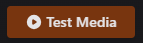

# Test Media

Maintainerr comes with a built-in feature to test your ruleset against your media, and display the results to you. This can be done without ever running a rule or creating collections in Plex. Sometimes, it is hard for you to determine why something was or wasn't added to a collection. Using the Test Media feature can be an extremely useful tool in helping you figure out what is going on.

## Test Media button

The first thing you must do, in order to use this function, is to create a rule. More on that can be found in the Rules documentation, as well as in the Walkthroughs.

[Rules](https://docs.maintainerr.info/Rules/){ .md-button .md-button--primary }
[Walkthroughs](https://docs.maintainerr.info/blog/){ .md-button .md-button--primary }

After creating your rule, and saving it, you will be brought back to the Rules page. Now you want to click on the Collections tab on the left menu. Here you will be shown all of your collections.

Click on the name of the collection that you want to test rules for. You will be taken to the Collection's page. Here you will see the Test Media button at the top left. You can also see any exclusions that you may have setup for this collection, as well as information regarding the collection items.

 

## Test Media screen

Depending on what type of library/media this collection is for, you will have different options at the top of this popup.

| Field | Value |
| ----- | ----- |
| Media | Name of a movie or TVShow that you want to test |
| Season | Select which season you want to test (if TV) |
| Episode | Select the episode you want to test (if TV) |
| Output | The test results in YAML format |

